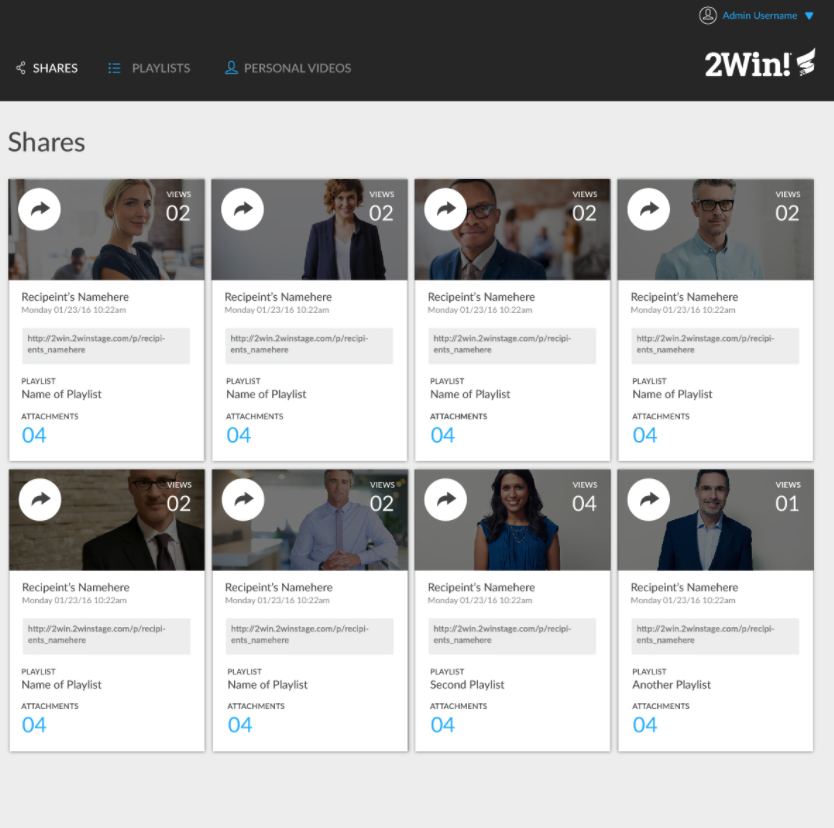

# Static Comp Challenge 1

For this assignment, we were asked to recreate a webpage based off of a [provided static comp](https://frontend.turing.io/projects/module-1/m1-static-comp). The objective was to build a responsive webpage (utilizing CSS flex-box and/or grid) that respects the integrity of the original design, but we had creative freedom on images, copy, icons, and colors.

## Original Comp

Here is the static comp we were given as a starting point.

## Final Webpage

Here is the final webpage, which is responsive over four breakpoints to adapt to different screen sizes.

### Large screen / four boxes wide:

### Medium screen / three boxes wide:

### Small screen / two boxes wide:

### Mobile screen / one box wide:

### Sources

- Images were downloaded from [unsplash.com](https://unsplash.com/)
- Icons were downloaded from [flaticon.com](https://www.flaticon.com/)
